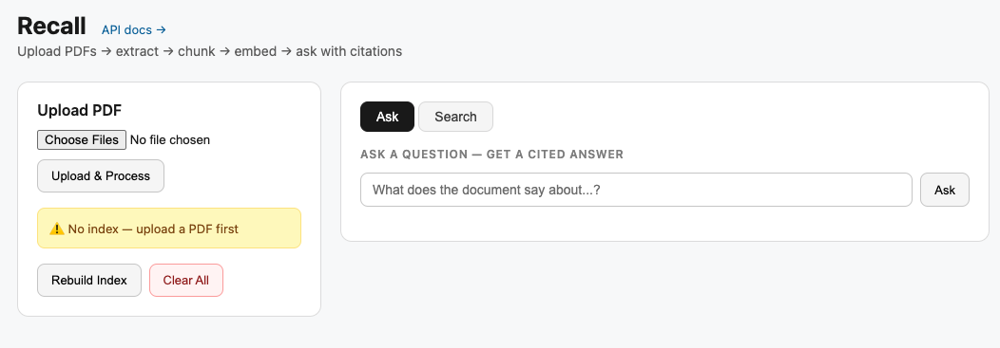
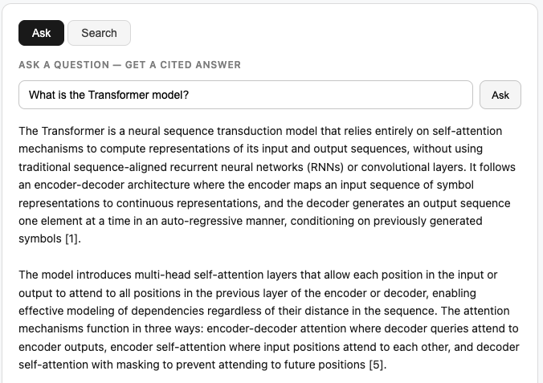
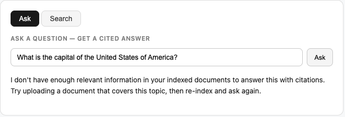
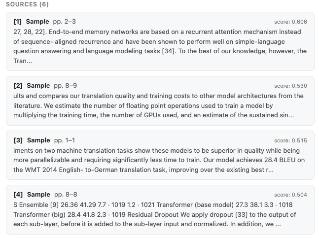
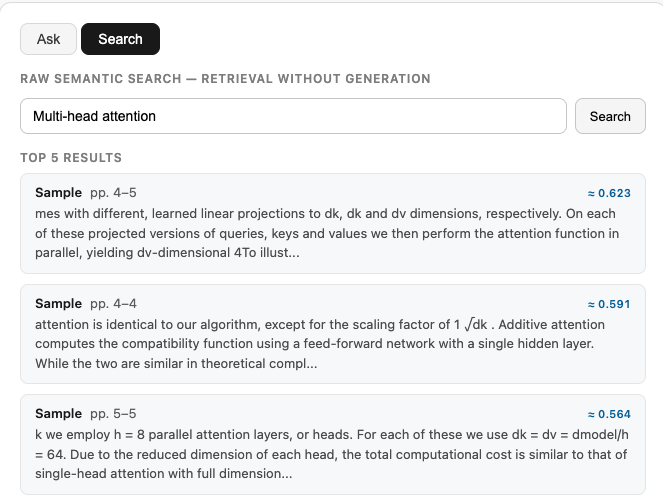

# Recall

Semantic document search and RAG (Retrieval-Augmented Generation) built with FastAPI, PostgreSQL, and FAISS.

Upload PDFs → they are parsed, chunked, and embedded → ask questions → get grounded answers with page-level citations.

---
## Dashboard


## What it does

1. **Ingest**: Upload a PDF. The pipeline extracts text page-by-page (PyMuPDF), splits it into overlapping 1200-character windows, and stores each chunk in PostgreSQL with its page range.
2. **Index**: Chunks are embedded with OpenAI `text-embedding-3-small` (1536-dim) and stored in a FAISS flat inner-product index. Vectors are L2-normalized so inner product equals cosine similarity.
3. **Retrieve**: A query is embedded the same way. FAISS returns the top-k most similar chunks by cosine score in ~1ms.
4. **Generate**: Retrieved chunks are numbered and passed as context to `gpt-4.1-mini`. The model is required to cite every claim as `[n]`, and those citations are resolved to document title and page range in the UI.

---

## Stack

| Layer | Technology |
|---|---|
| API | FastAPI + Uvicorn |
| Database | PostgreSQL 16 (SQLAlchemy 2, Alembic) |
| Vector index | FAISS `IndexFlatIP` (exact cosine via L2-normalized inner product) |
| Embeddings | OpenAI `text-embedding-3-small` (1536-dim) |
| Generation | OpenAI `gpt-4.1-mini` via Responses API |
| PDF parsing | PyMuPDF (fitz) |
| UI | Jinja2 single-page template |

---

## Quickstart

```bash
# 1. Clone and install
make install

# 2. Configure environment
cp .env.example .env
# Edit .env — add your OPENAI_API_KEY

# 3. Start PostgreSQL
make db

# 4. Run migrations
make migrate

# 5. Start the server
make dev
```

Open [http://localhost:8000](http://localhost:8000).

The full API is documented at [http://localhost:8000/docs](http://localhost:8000/docs).

---

## Manual setup (without Make)

```bash
python -m venv .venv
source .venv/bin/activate
pip install -r requirements.txt

cp .env.example .env   # add OPENAI_API_KEY

docker compose up -d
alembic upgrade head
uvicorn app.main:app --reload
```

---

## Usage

### Via the UI (recommended for demos)

1. Open `http://localhost:8000`
2. Upload one or more PDFs — the pipeline runs automatically (extract → chunk → embed → index)
3. Type a question in the **Ask** tab (if able, will answer, if not, does not hallucinate responses)





4. The answer appears with numbered citations: document title, page range, cosine score, and snippet



5. Switch to the **Search** tab to see raw FAISS retrieval results without generation



### Via the API

```bash
# Upload a PDF (file-only, no pipeline)
curl -X POST http://localhost:8000/documents/upload \
  -F "file=@yourfile.pdf"

# Rebuild the FAISS index from all chunks in Postgres
curl -X POST http://localhost:8000/search/rebuild

# Retrieval only — top-k chunks with cosine scores
curl -X POST http://localhost:8000/query \
  -H "Content-Type: application/json" \
  -d '{"query": "what is the main argument?", "top_k": 5}'

# Retrieval + LLM generation with citations
curl -X POST http://localhost:8000/answer \
  -H "Content-Type: application/json" \
  -d '{"query": "what is the main argument?", "top_k": 5}'
```

> Note: `POST /documents/upload` (API) saves the file only. To run the full pipeline via the API, call `/documents/{id}/extract`, then `/documents/{id}/chunk`, then `POST /search/rebuild`. The UI upload handles all steps automatically.

### Seed with a sample document

```bash
make seed
```

Downloads a public-domain PDF and runs the full pipeline, printing page count, chunk count, and vector count.

---

## Benchmarking

```bash
make benchmark
```

Builds a synthetic FAISS index with 2,500 vectors (1536-dim) and runs 100 queries, reporting p50/p95/p99 latency. FAISS `IndexFlatIP` at this scale takes under 1ms per query — the sub-300ms end-to-end claim is dominated by the OpenAI embedding API call (~100–200ms), not retrieval.

---

## Document lifecycle

| Status | Meaning |
|---|---|
| `uploaded` | File saved to disk, pipeline not yet started |
| `processing` | Extract + chunk pipeline running |
| `ready` | Pipeline complete, chunks in Postgres, indexed in FAISS |
| `failed` | Pipeline failed — `error` field on the document contains the reason |

---

## Project structure

```
app/
  api/          # FastAPI route handlers (documents, search, query, answer)
  core/         # Shared infrastructure (embeddings, FAISS, LLM, settings)
  db/           # SQLAlchemy engine, session, dependency injection
  models/       # ORM models (Document, Chunk) and status enum
  services/     # Business logic (extract, chunk, pipeline, indexing, admin)
  ui/           # Jinja2 template + routes for the browser UI
alembic/        # Database migrations
scripts/        # Benchmark and seed utilities
fixtures/       # Sample PDF for offline demos
storage/        # Runtime: uploaded PDFs, extracted pages JSON, FAISS index (gitignored)
docs/           # Architecture, resume alignment, demo script
```

---

## Architecture

See [docs/architecture.md](docs/architecture.md) for the full ingestion pipeline, RAG flow, data model, and design tradeoffs.

---

### Storage in production

`storage/` holds two kinds of files that must survive container restarts:
- `doc_*.pdf` and `doc_*.pages.json` — uploaded documents and extracted pages
- `faiss.index` and `faiss_map.json` — the vector index

Mount a persistent volume at `/app/storage`, or replace file-based storage with S3 (for PDFs) and a managed vector store (for the index). The FAISS index can be regenerated at any time by running `POST /search/rebuild`, so it does not need to be backed up separately as long as the Postgres chunks are intact.

---

## Future improvements

- **Semantic chunking**: split on sentence or paragraph boundaries instead of fixed character windows, so chunks align with natural units of meaning.
- **Incremental indexing**: append new chunk embeddings to the existing FAISS index instead of full rebuilds, to avoid O(n) re-embedding on every upload.
- **Streaming answers**: stream tokens from the LLM back to the browser instead of waiting for the full response.
- **Reranking**: add a cross-encoder reranker (e.g. Cohere Rerank) between FAISS retrieval and generation to improve precision before the model sees the context.
- **Multi-turn chat**: maintain conversation history so follow-up questions are answered in context.
- **Hybrid search**: combine dense (FAISS) with sparse (BM25/full-text) retrieval for better coverage on keyword-specific queries.
